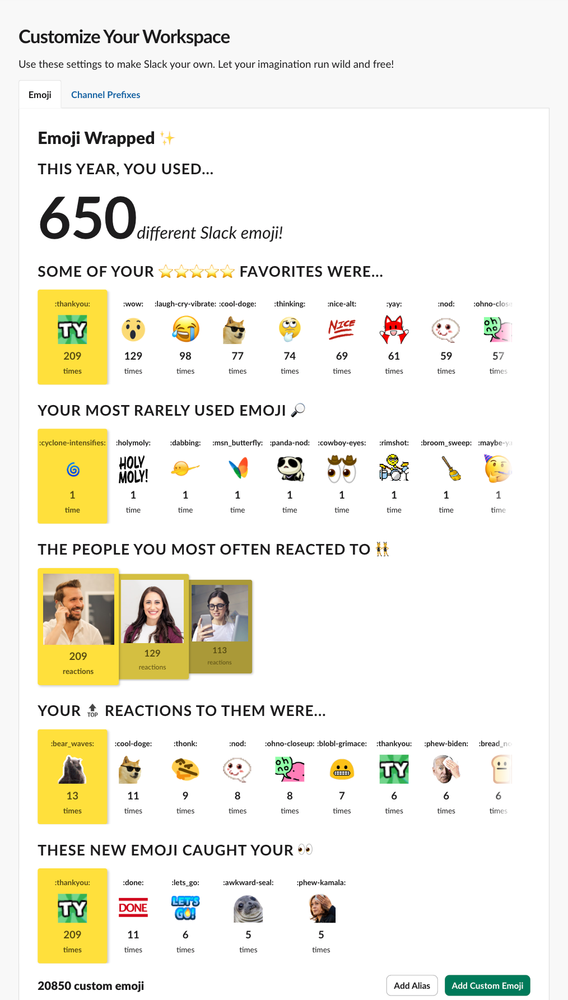
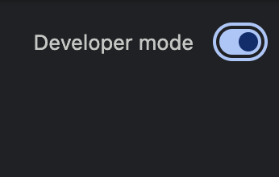
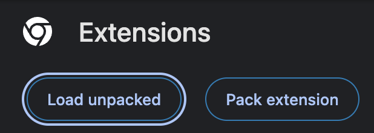
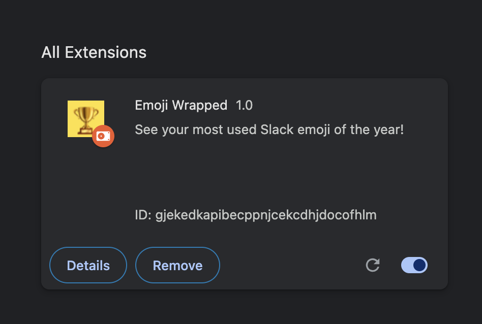
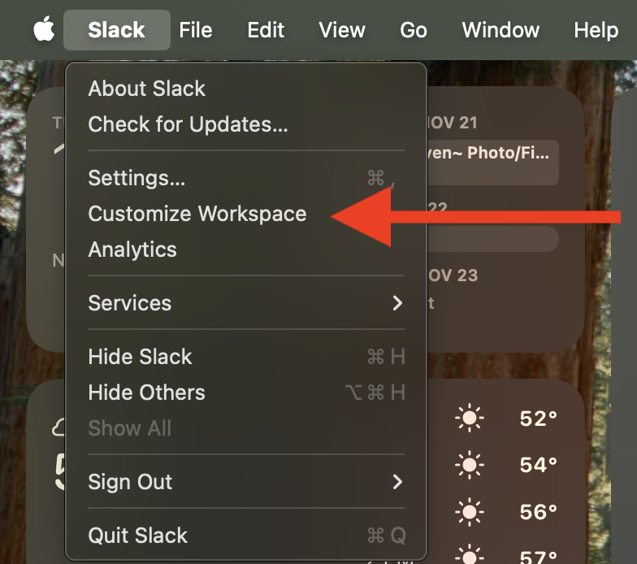
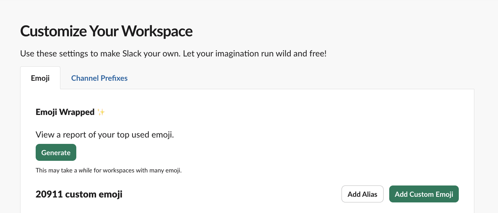

# 🏆 Emoji Wrapped 📈

The **Emoji Wrapped** Chrome extension allows you to generate a report of your most used emoji of the year to date!

**⚠️ _Warning:_ In it's current state, this can take several hours to run for enterprise workspaces.**

## Steps to Install

### Chrome Web Store

Install the extension from Chrome Web Store [here](https://chromewebstore.google.com/detail/emoji-wrapped/kebifpbmgkobfgeajkapfmianmfjbdih?authuser=1&hl=en).

### Manually

1. Download the repo as a [ZIP file](https://github.com/rubencodes/EmojiWrapped/archive/refs/heads/main.zip), and unzip it.
2. Go to your [Chrome Extensions](chrome://extensions/) settings, and toggle the "Enable Developer Mode" switch on. 
3. Press the "Load Unpacked" button, and select the unzipped repo folder. 
   - You should now see the Chrome Extension appear in your extensions list: 

## Usage

1. In Slack, under the main menu, select "Customize Workspace". 
   - If you have multiple workspaces, select one, and press "Open".
2. On the webpage that opens, above your workspace emoji list, you should now see an option to generate a report of your Slack emoji usage: 

## How It Works

We first request every emoji in your enterprise (`emoji.adminList`). Then we loop through that list and, in series, run a search request (`search.modules.messages`) for any messages this year (`after:2024-01-01`) containing that emoji reaction from you (`hasmy::emoji-name:`).

The second set of requests is the slow(er) part of the process—this can potentially be tens of thousands of requests depending on how many emoji your Slack workspace has, and due to rate-limiting I don't know if there's a way to speed that up. We don't initially have data about which emoji you've actually used, either, so I haven't found any way to limit the search to that subset.

These API calls rely on API tokens and other info retrieved directly from the global Window object data on the Customize Workspace page (`window.TS`).

## Notes

- Generating an Emoji Wrapped report can be _very_ slow, especially for large enterprises with many emoji, mostly due to rate-limiting of the Slack API. **Expect this to take on the order of hours to complete** if your workspace has >5k emoji. It will, eventually, complete, though—just leave it open in the background. Trust in the progress bar!
- For a ball-park estimate, the number of emoji roughly equals how many seconds it will take to complete. So a workspace with 1,000 emoji => ~1,000 sec => ~16.6 min. 10,000 emoji => ~10,000 sec => ~2.77 hrs.
- **No data from this extension ever leaves your local machine!** The only API calls made are directly to Slack for retrieving data.
  - As a point of reference, for my ~20k emoji workspace, this takes about ~5-6hrs to fully run.
- The _"People you most often reacted to"_ and _"Your top reactions to them"_ stats in particular aren't completely accurate; we're only looking at the first page of results for each emoji, and paginating could potentially slow the whole process down even more, so we don't do that. Think of both of those as having a recency bias.
- This does cache your results locally, so once it finishes once, you'll see your cached emoji wrapped results appear instantly on subsequent loads. You can select the "Regenerate" option to fully regenerate a report with fresh data.
- If you can think of any way to speed this up, I'm all ears! Open to ideas.
